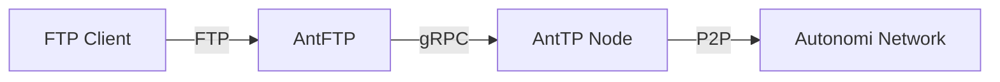

# AntFTP

AntFTP is an FTP server skeleton designed to bridge FTP commands to **AntTP** via gRPC and Protobuf. It allows users to access AntTP archives using standard FTP clients.

## Features

- **AntTP Integration**: Directly interacts with AntTP archives using gRPC.
- **Pointer Support**: Can resolve archive addresses via AntTP pointers.
- **Rclone Compatibility**: Works seamlessly with `rclone` to provide a FUSE mount over FTP.

## Design

AntFTP acts as a proxy between the FTP protocol and the AntTP gRPC interface. It uses `libunftp` as the core FTP engine and implements a custom storage backend (`unftp-sbe-anttp`) that translates file operations into gRPC calls to an AntTP node.



## Usage

### Command Line Arguments

You can run AntFTP with the following arguments:

- `-a`, `--archive <ARCHIVE>`: The AntTP archive hash to use. (Default: `efdcdc93db39d5ffef254f9bb3e069fc6315a1054f20a8b00343629f7773663b`)
- `-p`, `--pointer-name <POINTER_NAME>`: Optional pointer name to resolve the archive address from AntTP.
- `-l`, `--listen-address <LISTEN_ADDRESS>`: The address and port the FTP server will listen on. (Default: `127.0.0.1:2121`)

Example:
```bash
./antftp --archive <your-archive-hash> --listen-address 127.0.0.1:2121
```

### Environment Variables

- `ANTTP_GRPC_ENDPOINT`: The gRPC endpoint of the AntTP node. (Default: `http://localhost:18887`)

## Connecting with an FTP Client

You can use any standard FTP CLI client to connect to AntFTP.

### Using standard `ftp` client:

1. Connect to the server:
   ```bash
   ftp 127.0.0.1 2121
   ```
2. When prompted for a user, you can use any name (e.g., `anonymous`) as authentication is currently handled by the AntTP archive permissions.
3. You can now use standard FTP commands like `ls`, `get`, `put`, etc.

## FUSE Mount with Rclone

You can use `rclone` to mount an AntTP archive as a local file system via AntFTP.

1. **Configure Rclone**:
   Add a new FTP remote in `rclone`:
   ```bash
   rclone config
   ```
   - Name: `anttp`
   - Type: `ftp`
   - Host: `127.0.0.1`
   - User: `anonymous`
   - Port: `2121`

2. **Mount the Archive**:
   ```bash
   mkdir ~/mnt/anttp
   rclone mount anttp: ~/mnt/anttp --vfs-cache-mode full
   ```

Now you can browse your AntTP archive as if it were a local directory.

## License

This project is licensed under the MIT License - see the [LICENSE](LICENSE) file for details.
